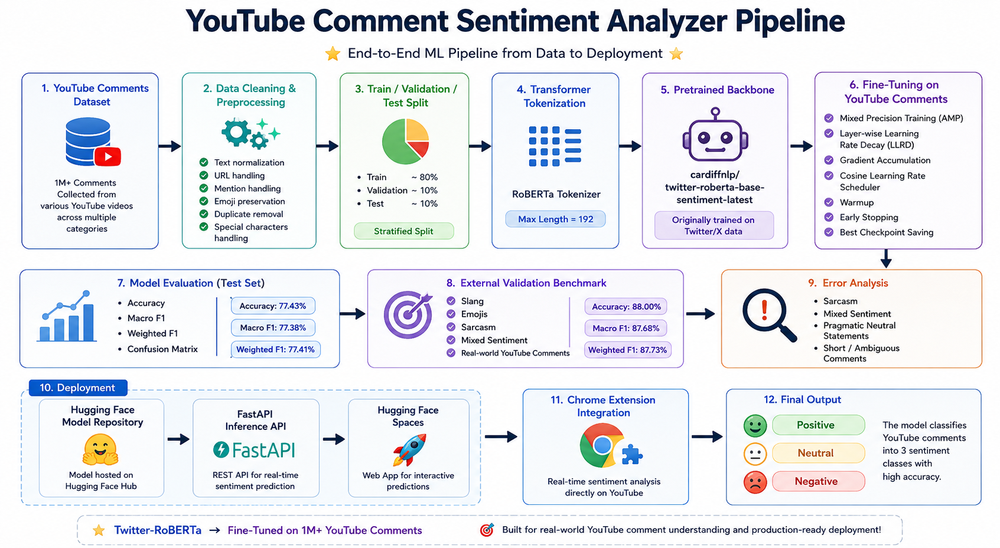
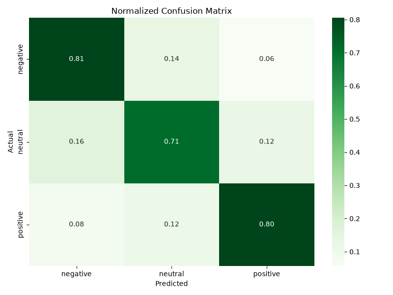

```
 ██████╗ ██████╗ ███╗   ███╗███╗   ███╗███████╗███╗   ██╗████████╗
██╔════╝██╔═══██╗████╗ ████║████╗ ████║██╔════╝████╗  ██║╚══██╔══╝
██║     ██║   ██║██╔████╔██║██╔████╔██║█████╗  ██╔██╗ ██║   ██║
██║     ██║   ██║██║╚██╔╝██║██║╚██╔╝██║██╔══╝  ██║╚██╗██║   ██║
╚██████╗╚██████╔╝██║ ╚═╝ ██║██║ ╚═╝ ██║███████╗██║ ╚████║   ██║
 ╚═════╝ ╚═════╝ ╚═╝     ╚═╝╚═╝     ╚═╝╚══════╝╚═╝  ╚═══╝   ╚═╝

 ███████╗███████╗███╗   ██╗███████╗███████╗
 ██╔════╝██╔════╝████╗  ██║██╔════╝██╔════╝
 ███████╗█████╗  ██╔██╗ ██║███████╗█████╗
 ╚════██║██╔══╝  ██║╚██╗██║╚════██║██╔══╝
 ███████║███████╗██║ ╚████║███████║███████╗
 ╚══════╝╚══════╝╚═╝  ╚═══╝╚══════╝╚══════╝
```

### Understanding YouTube Sentiment at Scale


---

**CommentSense** is an end-to-end NLP and MLOps project for sentiment analysis on YouTube comments.

Built by fine-tuning **Twitter-RoBERTa** on **1 Million+ YouTube comments**, CommentSense understands internet slang, emojis, creator-audience interactions, and social-media language patterns that traditional sentiment models often fail to capture.

Unlike most sentiment-analysis projects that immediately jump to transformers, CommentSense follows a complete machine learning journey—from classical NLP baselines to modern transformer architectures—allowing performance gains, trade-offs, and design decisions to be measured at every stage.

### 🚀 Links

* 🤗 Hugging Face Model → [Link]
* 🚀 Hugging Face Space → [Link]
* 📖 API Documentation → [Link]

---

# 🎯 Why CommentSense?

Most sentiment-analysis systems are trained on:

* Product reviews
* Movie reviews
* News articles
* Formal text

But YouTube comments are fundamentally different.

```text
W video bro 🔥

Absolute cinema

Bro cooked 💀

Nah this ain't it

First!!!

Who's here in 2026?
```

These comments contain:

* Internet slang
* Emojis
* Creator terminology
* Meme culture
* Short context
* Informal grammar

Traditional NLP approaches struggle because they rely heavily on token frequencies and manually engineered features.

CommentSense was built specifically to understand how people communicate on YouTube.

---

# ✨ What It Does


<p align="center">
  
</p>


### Core Features

✅ Positive / Neutral / Negative Classification

✅ Social-Media-Aware Transformer

✅ Emoji & Slang Understanding

✅ Real-Time FastAPI Inference

✅ Hugging Face Deployment

✅ Chrome Extension Ready

✅ Production API

---

# 📊 Performance

### Real-World External Validation Benchmark

A manually curated benchmark designed to simulate real YouTube comments.

Included:

* Internet slang
* Emojis
* Creator terminology
* Viral phrases
* Mixed sentiment
* Short-form reactions

| Metric      | Score      |
| ----------- | ---------- |
| Accuracy    | **88.00%** |
| Macro F1    | **87.68%** |
| Weighted F1 | **87.73%** |

Unlike standard train-test evaluation, this benchmark was designed to better approximate real-world deployment performance.

---

# 🧠 Why Twitter-RoBERTa?

Instead of training a transformer from scratch, CommentSense leverages:

```text
cardiffnlp/twitter-roberta-base-sentiment-latest
```

Twitter/X and YouTube comments share many linguistic characteristics:

* Informal writing
* Emojis
* Slang
* Social-media culture
* Short text

This makes Twitter-RoBERTa an ideal starting point for transfer learning.

The model was then fine-tuned on a large-scale YouTube comments dataset containing over **1 Million labeled comments**, allowing it to adapt specifically to YouTube language patterns.

```text
Twitter/X Posts
        ↓
Twitter-RoBERTa
        ↓
Fine-Tuning on 1M+ YouTube Comments
        ↓
CommentSense
```

---

# 🧪 Model Journey

Most projects start here:

```text
Dataset
   ↓
Transformer
   ↓
Done
```

CommentSense followed a different approach.

The objective was to understand:

> How far can traditional NLP take us before transformers become necessary?

```text
Bag of Words
      ↓
Random Forest
      ↓
TF-IDF
      ↓
TF-IDF + N-Grams
      ↓
LightGBM
      ↓
LightGBM + Optuna
      ↓
Twitter-RoBERTa
      ↓
CommentSense
```

## Phase 1 — Random Forest Baseline

Pipeline:

```text
Bag of Words
      +
Random Forest
```

Result:

```text
~65% Accuracy
```

Key Observation:

The model struggled with:

* Slang
* Emojis
* Negation
* Contextual sentiment

Example:

```text
W video bro 🔥
```

The model could not understand that this phrase expresses positive sentiment.

---

## Phase 2 — Feature Engineering

Experiments:

* TF-IDF
* Bigrams
* Trigrams
* Vocabulary optimization

Result:

```text
~75% Accuracy
```

Key Insight:

Feature representation mattered more than model complexity.

Better text representation produced larger gains than changing algorithms.

---

## Phase 3 — LightGBM

Pipeline:

```text
TF-IDF
      +
LightGBM
```

Why LightGBM?

* Handles sparse features efficiently
* Faster training
* Better generalization
* Strong tabular performance

Result:

```text
~86% Accuracy
```

This was the first model capable of delivering production-quality performance.

---

## Phase 4 — Optuna Hyperparameter Optimization

Parameters tuned:

* Learning Rate
* Max Depth
* Num Leaves
* Feature Count
* Regularization
* N-Gram Range

Result:

```text
Validation Macro F1 ≈ 0.91
```

One of the most valuable outcomes was discovering and fixing a data leakage issue that had artificially inflated earlier results.

This reinforced the importance of rigorous evaluation and reproducible experimentation.


## Why Move Beyond LightGBM?

Despite achieving strong validation performance, several limitations remained.

Traditional NLP features treat text as token counts and cannot fully capture semantic meaning.

Example:

```text
I thought this would be terrible but it was amazing
```

The sentiment depends on relationships between words rather than individual tokens.

Similarly, comments such as:

```text
Absolute cinema

Bro cooked 🔥

W video

Nah this ain't it
```

require understanding of internet culture, slang, and context.

This is where transformer architectures begin to outperform traditional machine learning approaches.

---

# 🚀 Phase 5 — CommentSense

The final stage fine-tuned a social-media-aware transformer on YouTube comments.

### Backbone

```text
cardiffnlp/twitter-roberta-base-sentiment-latest
```

### Why This Model?

Twitter/X and YouTube comments share many characteristics:

* Emojis
* Informal writing
* Slang
* Abbreviations
* Social-media language
* Short text

Rather than training a transformer from scratch, transfer learning was used.

```text
Twitter/X Data
        ↓
Twitter-RoBERTa
        ↓
Fine-Tuning on 1M+ YouTube Comments
        ↓
CommentSense
```

### Training Enhancements

CommentSense incorporates:

* Mixed Precision Training (AMP)
* Layer-wise Learning Rate Decay (LLRD)
* Gradient Accumulation
* Cosine Learning Rate Scheduler
* Warmup Scheduling
* Gradient Checkpointing
* Early Stopping
* Class Weighted Loss
* Dynamic GPU Configuration
* Checkpoint Recovery

The result is a transformer specifically adapted to YouTube comment sentiment analysis while retaining the social-media understanding learned during Twitter pretraining.

---

# 📈 Evaluation

## Internal Test Set

| Metric      | Score  |
| ----------- | ------ |
| Accuracy    | 77.43% |
| Macro F1    | 77.38% |
| Weighted F1 | 77.41% |

The internal test set was sampled from the same distribution as the training data.

---

## Real-World External Validation

To better estimate deployment performance, a separate benchmark was manually curated.

Included:

* Slang
* Emojis
* Creator terminology
* Meme culture
* Mixed sentiment
* Ambiguous comments

Examples:

```text
W video bro 🔥

Absolute cinema

Bro cooked 💀

Who's here in 2026?

Nah this ain't it
```

Results:

| Metric      | Score  |
| ----------- | ------ |
| Accuracy    | 88.00% |
| Macro F1    | 87.68% |
| Weighted F1 | 87.73% |

This benchmark is considered the most representative measure of real-world performance.

---


# 📊 Normalized Confusion Matrix

The model performs consistently across all sentiment classes without severe class imbalance.

Most prediction errors occur between Neutral and Positive comments.

Negative sentiment is generally detected more reliably.

<p align="center">
  
</p>

---

# 🔥 Example Predictions


### Positive

```text
Absolute cinema
```

Prediction:

```text
Positive
```

---

### Negative

```text
Nah this ain't it
```

Prediction:

```text
Negative
```


---

### Neutral

```text
Uploaded 2 hours ago
```

Prediction:

```text
Neutral
```

---

# 🚀 Deployment

```text
YouTube Comment
        ↓
Chrome Extension
        ↓
FastAPI API
        ↓
Hugging Face Space
        ↓
CommentSense
        ↓
Sentiment + Confidence
```

### Components

#### Hugging Face Model

Stores:

* Fine-tuned weights
* Tokenizer
* Configuration

#### Hugging Face Space

Hosts:

* FastAPI backend
* Interactive demo
* Real-time inference

#### Chrome Extension

Provides sentiment analysis directly within the YouTube experience.

---

# 💻 API Example

### Request

```http
POST /predict
```

```json
{
  "text": "Absolute cinema 🔥"
}
```

### Response

```json
{
  "sentiment": "positive",
  "confidence": 0.997
}
```

---

# 🛠 Tech Stack

## NLP

* Hugging Face Transformers
* RoBERTa
* Tokenizers

## Machine Learning

* PyTorch
* Scikit-Learn
* LightGBM
* Optuna

## Data Processing

* Pandas
* NumPy

## MLOps

* DVC
* FastAPI
* Docker
* Hugging Face Hub
* Hugging Face Spaces

## Deployment

* FastAPI
* Hugging Face
* Chrome Extension

---

# 📂 Repository Structure

```text
src/
├── data/
├── features/
├── model/
├── evaluation/
├── inference/
├── api/
└── deployment/

artifacts/
├── models/
├── features/
└── deployment_model/

data/
```

---

# 🎓 Key Learnings

* Data leakage can dramatically inflate performance.
* External validation is critical.
* Validation scores do not always reflect deployment performance.
* Feature engineering remains valuable even in the transformer era.
* Transfer learning drastically reduces training costs.
* MLOps and deployment are as important as model training.

---

# 🔮 Future Roadmap

### Model Improvements

* Multilingual Sentiment Analysis
* Sarcasm Detection
* Emotion Classification
* Aspect-Based Sentiment Analysis

### Product Improvements

* Creator Analytics Dashboard
* Brand Monitoring
* Comment Trend Analysis
* Real-Time Stream Processing


---

# 👨‍💻 Author

## Rishiraj Gupta

M.Sc. Data Science

CommentSense was built as an end-to-end NLP and MLOps project demonstrating:

✅ Traditional NLP Baselines

✅ Feature Engineering

✅ Hyperparameter Optimization

✅ Transformer Fine-Tuning

✅ Evaluation & Error Analysis

✅ External Validation

✅ FastAPI Development

✅ Hugging Face Deployment

✅ Production Inference APIs

---

### ⭐ If you found this project interesting, consider giving it a star.

Built with ❤️ using PyTorch, Transformers, FastAPI, and Hugging Face.

